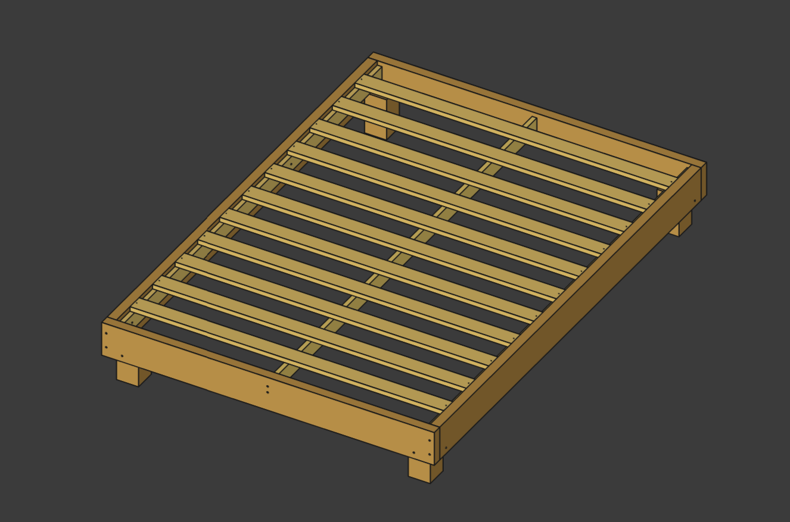

# My Bedframe

This is my bedframe.

⚠️ Work in progress! ⚠️



## Specs

[Mattress](https://www.leesa.com/products/leesa-mattress): 53" by 75" by 10"

Bed Height: 20" (About knee height for me)

Slat Spacing: Maximum 4"

## Parts List

|     Part     | Quantity |     Description     |
|--------------|----------|---------------------|
| 4.41' x 2x6  | 2        | Foot and Head       |
| 6.00' x 2x6  | 2        | Sides               |
| 6.00' x 1x3  | 3        | Rails and Support   |
| 4.17' x 1x3  | 11       | Slats               |
| 6.75" x 4x4  | 4        | Feet                |
| 2" Wood Screw| 8        |                     |
| 3" Wood Screw| 20       |                     |
| 1 1/4" Nail  | 22       |                     |

## Number of Slats

The following equation calculates the spacing between slats `s` for a given length `l`, slat width `w`, and number of slats `n`:

```c
s = (l - n * w) / (n + 1)
```

This equation can be easily rearranged to solve for the number of slats `n` for a max spacing `s`:

```c
n = ceil((l - s) / (s + w))
```

For `s = 4`, `l = 72`, and `w = 2.5`, the number of slats is 11 which results in a spacing of 3.7".

Since I am using variables in my design, this equation can be used directly to make it parametric.

## FreeCAD Notes

- Assemblies without good places for joints is not fun
- Making edits to parts in an assembly sometimes breaks assembly (depends on the change)
- It helps to already have the part near the right place when making a joint
- Variable sets are fun to work with
- Graphical glitches sometimes happen
- Some unexpected joint solving failures, but I could work around them
- Joint solving failures, but still worked 😕
- Working with the assembly makes the fans run
- Moving many components at once is very intense
