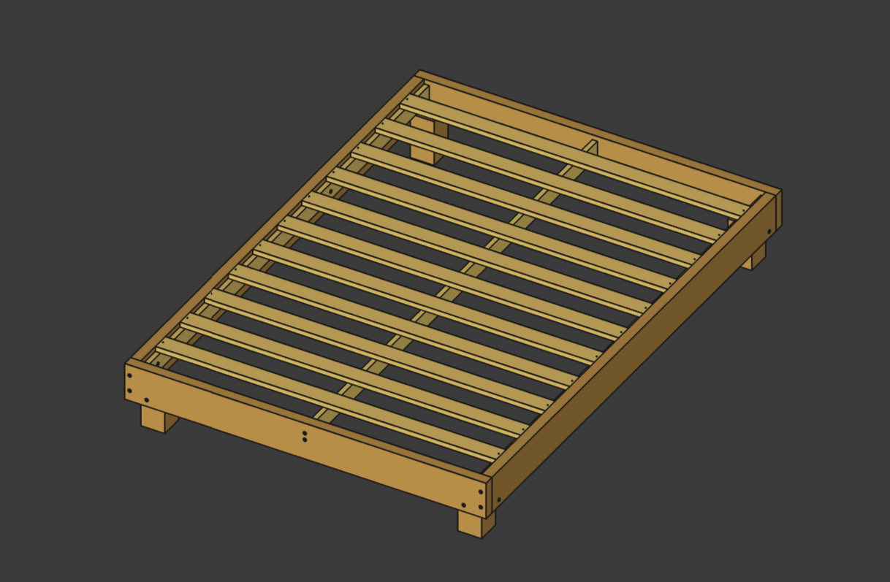

# My Bedframe

This is my bedframe.

⚠️ Work in progress! ⚠️



## Specs

[Mattress](https://www.leesa.com/products/leesa-mattress): 53" by 75" by 10"

Bed Height: 20" (About knee height for me)

Slat Spacing: Maximum 4"

## Number of Slats

The following equation calculates the spacing between slats `s` for a given length `l`, slat width `w`, and number of slats `n`:

```c
s = (l - n * w) / (n + 1)
```

This equation can be easily rearranged to solve for the number of slats `n` for a max spacing `s`:

```c
n = ceil((l - s) / (s + w))
```

For `s = 4`, `l = 72`, and `w = 2.5`, the number of slats is 11 which results in a spacing of 3.7".

Since I am using variables in my design, this equation can be used directly to make it parametric.

## FreeCAD Notes

- Assemblies without good places for joints is not fun
- Making edits to parts in an assembly sometimes works and sometimes doesn't
- Variable sets are fun to work with
- Graphical glitches sometimes happen
- Some unexpected joint solving failures, but I could work around them
